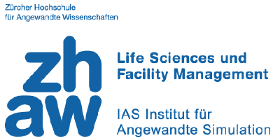

    
    
    

# Real-time monitoring of available beds for intensive care units in Swiss Hospitals

## Devpost Projekt

* [Link](https://devpost.com/software/real-time-monitoring-of-available-beds-for-intensive-care) to our Devpost-Projekt

## Installation

* Check in here: [HOWTO.md](/HOWTO.md)

# Relevance to the Swiss ecosystem
Approximately 281 hospitals offer healthcare in Switzerland (BAS, 2017). In 2017, there were 1436’030 patients who were admitted to a hospital. In many cases, coordination between the hospitals can be crucial to save patients lives.
To facilitate the coordination between hospitals and to help decision makers allocate resources, we developed a concept (see [video](https://vimeo.com/404311432) and [presentation](/public/Presentation_ICU_management_Team_171.pdf)) for national, real-time data-collection which can be easily implemented in every hospital.

# Relevance of the solution in addressing the specific challenge
We are providing a digital, real-time and automated application for nurses and doctors in hospitals who need to send patients to other hospitals without loosing time by having to first find out where to send them to.

# Potential for impact on the long term
The cooperation between hospitals can be enhanced through the availability of nationwide, real-time data (for example coordinating emergency beds for patients). On the other side, decision-makers including the government can use the centralized data in the future for healthcare development, crisis management and further enhancements.
Based on the different input channels our plan is to automatically update the database.

# Progress achieved in the last 48 hours 
During \#VersusVirus our team was able to connect with several politicians, health authorities and doctors and with end-users (nurses and doctors). We were able to address the potential users’ needs by developing a system which is independent of the hospital IT-infrastructure. To facilitate data collection, scanning beds, materials, and patient IDs was introduced to help increase the efficiency of data entry and to ensure real-time data access.

# Project Added Value
We provide an overview for fast and informed decision-making. Hospitals can get for the first time easy and real-time access to data outside the cantonal borders. Fast information exchange is crucial in case of rapid high occupation of ICU beds (like in case of an epidemy). The data is graphically visualised to get a fast national overview of the hospital capacities.  
In a later step we want to implement filter options to be able to display only specific variables (display only  number of ventilators or combined with number of infusomats).
We guarantee real-time data by offering multiple data collection interfaces (scanners, mobile apps, API). The solution is conceptualized to be easily accessible from various devices (for example for first aid medics).  
In a further step we would like to integrate a learning system to provide a case development forecast with the results directly displayed in the application.

If the respective authorities (cantonal health departments, Koordinierter Sanitätsdienst and hospitals) provide us access to the [data stated in our github repo](/public/swiss_hospital_capacities.xlsx), we can provide a real-time hospital capacity monitoring system.

# Acknowledgements
We got international support from the app-developer of a similar challenge from the #WirVsVirus Hackathon Munich and from various mentors who tried hard to give us access to the necessary data.
